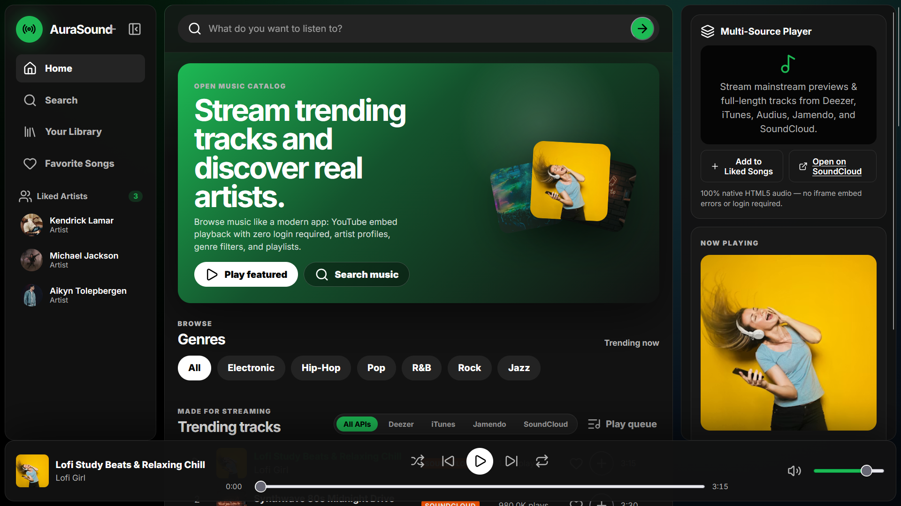
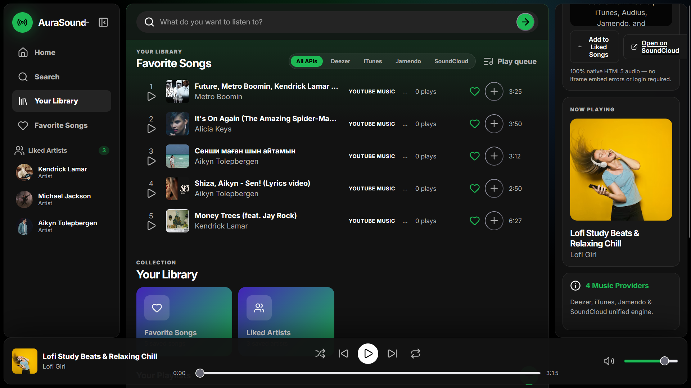

# 🎵 AuraSound — Mood Music Recommendation Engine

A high-performance music discovery and mood-based recommendation engine built with **Node.js**, **Express**, **Vite**, **Vanilla JavaScript**, and **Tailwind CSS**. Integrates multi-provider audio stream APIs (**Deezer**, **iTunes**, and **Jamendo**) for instant previews and high-res album artwork.

---

## 🖼️ Application Showcase

| **Mood Discovery & Music Player** | **Artist Profile & Track Queue** |
| :---: | :---: |
|  |  |
| *Interactive mood filtering, search & audio player* | *Artist profiles, high-res artwork & stream player* |

---

## ✨ Key Features

- 🎧 **Multi-Provider Audio Aggregator**:
  - Combines tracks from **Deezer API**, **iTunes Search API**, and **Jamendo API** in parallel.
  - Serves 30-second high-quality audio preview streams with 1000x1000 high-res album art.
- 🎭 **Mood & Vibe Recommendation Engine**:
  - Filter music by emotional resonance: *Focus, Energy, Chill, Party, Dark, Workout, Ambient*.
- 📻 **Interactive Audio Player**:
  - Full-featured playback bar with scrubbing timeline, play/pause, volume control, track queues, and previous/next navigation.
- 👤 **Artist Inspection & Search**:
  - Search any artist or song title across all 3 streaming APIs simultaneously with deduplicated result lists.
- ⚡ **Express + Vite Hybrid Architecture**:
  - Lightning-fast development server with integrated API middleware proxy to bypass CORS restrictions.
- ⚙️ **Vercel Deployment Ready**:
  - Includes pre-configured `vercel.json` routing both serverless Express API calls (`/api/*`) and static Vite SPA routes.

---

## 🛠️ Tech Stack

| Technology | Purpose |
| :--- | :--- |
| **Node.js & Express (v5)** | Backend API aggregator middleware & serverless handler |
| **Vite & ES Modules** | High-speed frontend build pipeline |
| **Vanilla JavaScript** | Audio Web API playback controller & UI state management |
| **Lucide Icons** | Modern SVG audio player control icons |
| **Tailwind CSS** | Responsive dark mode music desk styling |

---

## 🌐 Vercel Deployment Guide

To deploy `back3` to Vercel:

1. Create a `vercel.json` file in `back3`:
   ```json
   {
     "version": 2,
     "builds": [
       { "src": "server.js", "use": "@vercel/node" },
       { "src": "package.json", "use": "@vercel/static-build", "config": { "distDir": "dist" } }
     ],
     "routes": [
       { "source": "/api/(.*)", "destination": "/server.js" },
       { "handle": "filesystem" },
       { "source": "/(.*)", "destination": "/index.html" }
     ]
   }
   ```
2. Update the end of `server.js` to export `app`:
   ```javascript
   if (process.env.VERCEL) {
     export default app;
   } else {
     listen(port);
   }
   ```
3. Push to GitHub and deploy on Vercel!

---

## 🚀 Getting Started

### Prerequisites

Ensure **Node.js** (v18 or higher recommended) is installed on your computer.

### Installation & Local Run

1. Navigate to the project directory:
   ```bash
   cd back3
   ```

2. Install dependencies:
   ```bash
   npm install
   ```

3. Start the dev server:
   ```bash
   npm run dev
   ```

4. Open `http://localhost:5173` in your browser.

### Production Build

```bash
# Generate static build
npm run build

# Preview static production build
npm run preview
```

---

## 📁 Project Structure

```
back3/
├── images/                  # Place your preview-1.png & preview-2.png here
├── src/
│   ├── api/                 # Audio stream API adapters
│   ├── components/          # Audio player & track card UI
│   ├── main.js              # Web Audio player & application logic
│   └── style.css            # Dark mode music dashboard styles
├── index.html               # Main HTML entry file
├── server.js                # Express API aggregator & Vite dev middleware
├── package.json             # NPM dependencies & scripts
└── vite.config.js           # Vite configuration
```
